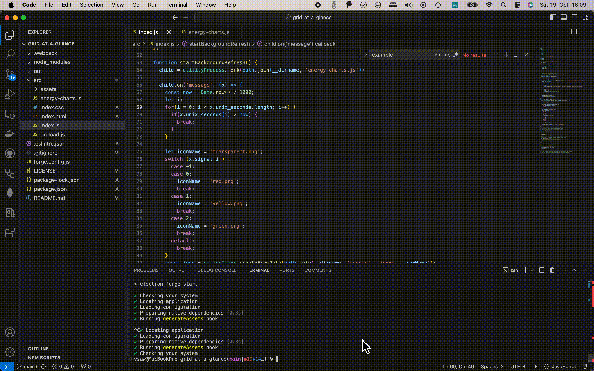

# Grid at a glance

A tray icon showing information about the electrical grid at real time

The Data is taken from https://energy-charts.info via their public API.

## Features

- Shows the current share of renewable electricity in the German grid
  - 🟢 >60%
  - 🟡 40% - 60%
  - 🔴 <40%
- Hover over the icon to see the chart for today
- Refreshes automatically in the background
- Shortcut to https://energy-charts.info for more info on electricity mix

## Installation

Download the latest release from [GitHub](https://github.com/vsaw/grid-at-a-glance/releases).

## Development

Grid at a glance is built on [ElectronJS](https://www.electronjs.org/).

Currently only tested under macOS, but should be working on Windows, Linux and macOS (Intel + Apple Silicon).

## License

Code shared under [MIT](License.md).

Tray Icons are based on [Feather](https://github.com/feathericons/feather).